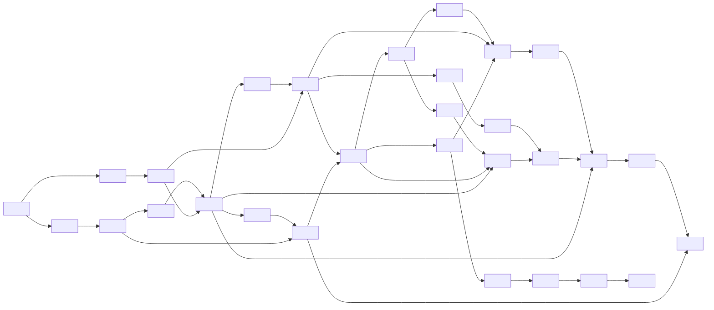
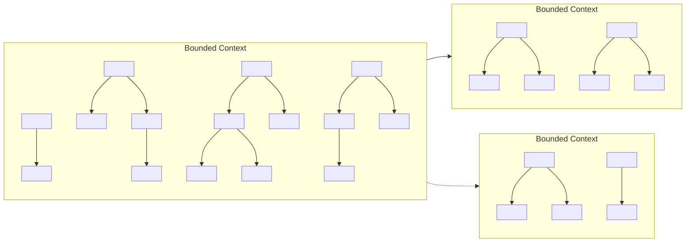
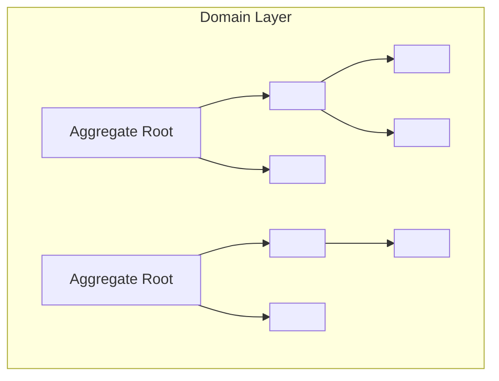

When software systems grow, especially in complex business domains, many evolve into a “Big Ball of Mud.”
This describes systems with tangled logic, messy code, and unclear dependencies, making them difficult to maintain.



Domain-driven design (DDD) focuses on capturing business logic directly in software.
By aligning code with business concepts, it helps manage complexity and improves collaboration between technical and business teams.

DDD handles complexity through two complementary approaches:

- **Strategic design**: Divides the system into clear, manageable areas called bounded contexts.
- **Tactical design**: Provides patterns for organizing domain logic within these contexts.

## Vertical slicing into bounded contexts

Each bounded context is responsible for a specific business area, isolated from other contexts.
Within each bounded context, terms, models, and rules have clear meanings, preventing confusion and ambiguity.



Bounded contexts ensure each area of the system has clear boundaries, making them easier to understand and evolve independently.

## Horizontal slicing into layers

After defining bounded contexts, each context is further organized into distinct horizontal layers:

```txt
+------------------------+
|    User Interface      |
+------------------------+
|     Application        |
+------------------------+
|        Domain          | <- Isolate the domain layer
+------------------------+
|    Infrastructure      |
+------------------------+
```

The domain layer is the heart of the system.
It encapsulates the business rules, decisions, and state changes that reflect real-world processes.
A core principle in DDD is to isolate this layer from external concerns.

## Tactical design within the domain layer

The domain layer can be further structured using tactical patterns.
A key concept is the aggregate, a cluster of domain objects treated as a single unit to enforce transactional consistency.
Each aggregate has an aggregate root, which defines the boundary for transactions and ensures integrity within the domain.
Other common tactical patterns include Entities, Value Objects, and Domain Events.



Tactical design helps ensure the domain layer remains clean, focused, and directly aligned with business logic.

## Case study: cal.com

Cal.com is an open-source scheduling platform for managing availability and booking meetings.  
Its complexity makes it ideal for demonstrating the advantages of DDD compared to simpler, toy examples.

> Domain-driven design pays off best for ambitious projects, ...
> Not all projects are ambitious.
>
> -- Eric Evans, Domain-Driven Design (the blue book)

## Implementation: cal.com.alt

We'll explore how DDD can be applied in a lightweight, pragmatic way with [cal.com.alt](https://github.com/evan-liu/cal.com.alt),  
a TypeScript-based reimagining of cal.com.
