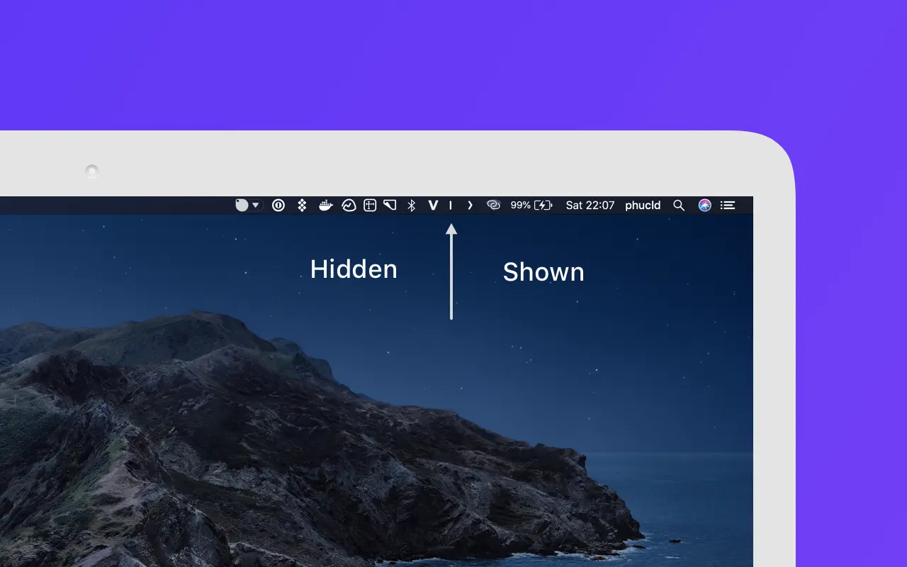

[Hidden Bar](https://apps.apple.com/app/hidden-bar/id1452453066) allows you to
hide menu bar items and only show them when needed.

import { Tabs, TabItem } from '@astrojs/starlight/components'
import BrewfileMas from '@components/BrewfileMas.astro'
import DownloadAppStore from '@components/DownloadAppStore.astro'

<Tabs>
  <TabItem label="App Store" icon="apple">
    <DownloadAppStore url="https://apps.apple.com/app/hidden-bar/id1452453066" />
  </TabItem>
  <TabItem label="brew bundle" icon="homebrew">
    <BrewfileMas name="Hidden Bar" id={1452453066} />
  </TabItem>
</Tabs>

---

👨‍💻 I try to keep every UI minimal, with only information that I need, including OS UI like the menu bar.

Besides System Time and Control Center, I hide all menu items except for:

- Input source. I still need to use [Chinese input](./squirrel) sometime.
- [RAM usage](./stats) until I get a Mac with so big RAM that I no longer care.
- [Battery](./stats) as I often use the Mac off the charger, e.g. in the office.
