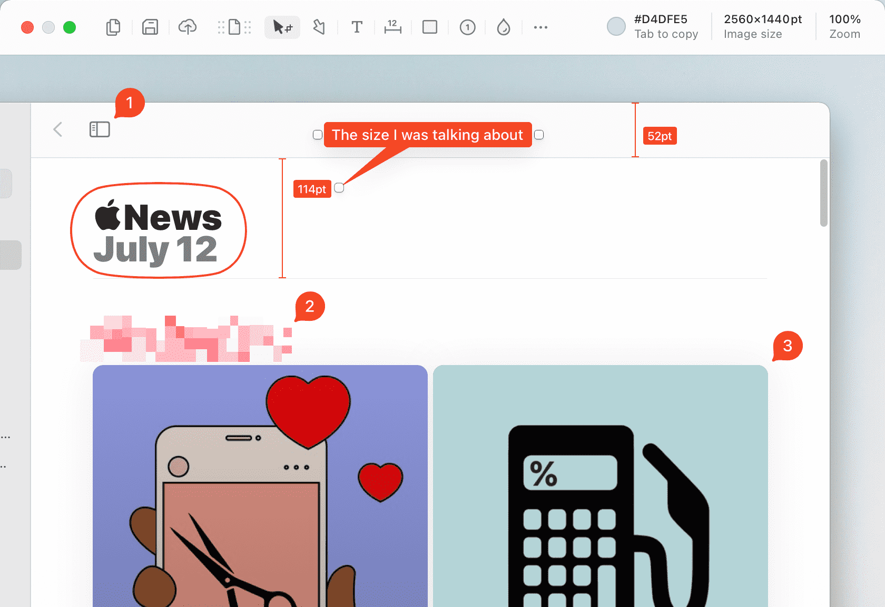

import { Tabs, TabItem } from '@astrojs/starlight/components'
import BrewInstallCask from '@components/BrewInstallCask.astro'
import BrewfileCask from '@components/BrewfileCask.astro'
import DownloadCard from '@components/DownloadCard.astro'
import Link from '@components/Link.astro'

export const components = { a: Link }

[Shottr](https://shottr.cc) is a Mac screenshot tool with annotations, scrolling screenshots, etc.

<Tabs>
  <TabItem label="brew install" icon="homebrew">
    <BrewInstallCask name="shottr" />
  </TabItem>
  <TabItem label="brew bundle" icon="homebrew">
    <BrewfileCask name="shottr" />
  </TabItem>
  <TabItem label="Download" icon="down-caret">
    <DownloadCard url="https://shottr.cc" />
  </TabItem>
</Tabs>

👨‍💻 I really like that it has keyboard shortcut for almost everything (e.g. `c` for adding a counter).
