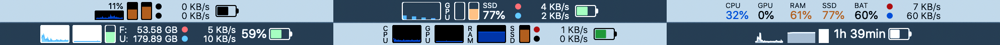

[Stats](https://github.com/exelban/stats) is a macOS system monitor in the menu bar.

import { Tabs, TabItem } from '@astrojs/starlight/components'
import BrewInstallCask from '@components/BrewInstallCask.astro'
import BrewfileCask from '@components/BrewfileCask.astro'
import DownloadCard from '@components/DownloadCard.astro'

<Tabs>
  <TabItem label="brew install" icon="homebrew">
    <BrewInstallCask name="stats" />
  </TabItem>
  <TabItem label="brew bundle" icon="homebrew">
    <BrewfileCask name="stats" />
  </TabItem>
  <TabItem label="Download" icon="right-arrow">
    <DownloadCard url="https://github.com/exelban/stats" />
  </TabItem>

</Tabs>

👨‍💻 I now only keep `RAM` and `Battery` in my menu bar.
